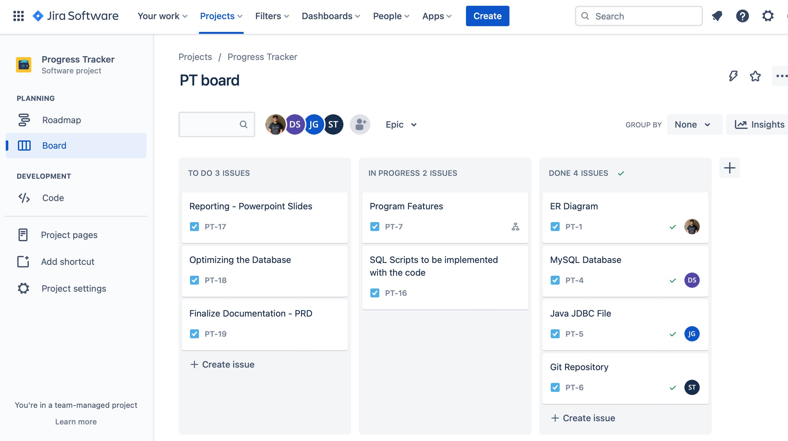
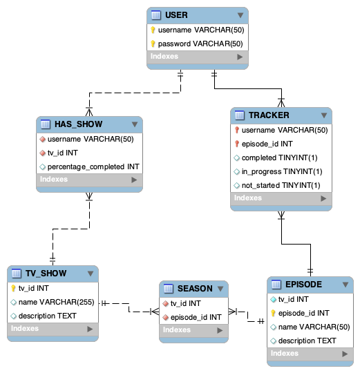

# Jump Tv
In this project, a user is able to log in and/or create account to utilize the Jump Tv to keep track of there progress watching top TV shows. 

## Technologies Utilized
* Java
    * JDBC - Java connector for MySQL
* MySQL
* Git
* JIRA Kanban Board

## Minimal Viable Product (MVP)
To ensure Jump TV's functionality, we ensured that following expectations were set:

<!-- [M] Users can login with a username and password -->

- [X] Create a login interface where users can login using a <u>username</u> and <u>password</u>

<!-- [M] A menu where users can navigate to different options to update and view their trackers -->

- [X] Create a menu where users can navigate to update and view there trackers.

<!-- [M] Users can make changes to their trackers -->

- [x] Allow users to make changes to there tracker

<!-- [M] Users can only access the information tied to their account -->

- [x] Ensure users can only access information tied to there username.

<!-- [M] Each user can view a tracker where they can see what is not yet completed,
in-progress, and completed -->

- [x] Allow each user to view a tracker where they can see:
    - Not Yet Completed
    - In-Progress
    - Completed

## Extensions
Users have more flexibility using Jump Tv with the follwing additions to the program:

<!-- Have an option to create an account if a user doesn’t have one -->

- [x] If user is unregistered, they can utilize our built-in account creation to create a new account

<!-- Anything in progress should have an indicator for how far along a user is in completing it -->

- [x] Shows that are 'In-Progress' have an indiccator for how along a user is from completing a show

## Project documentation

Kanban Board

Database ER Diagram

